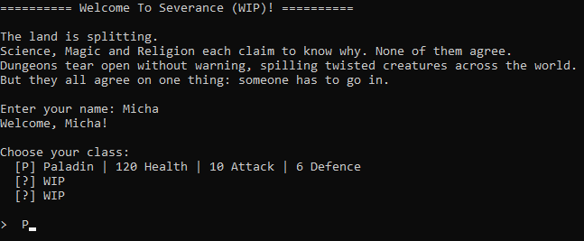
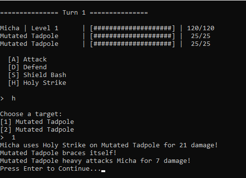
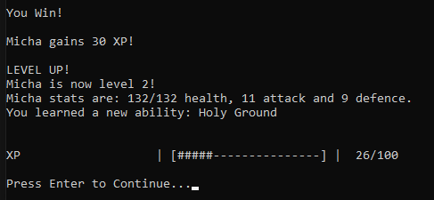
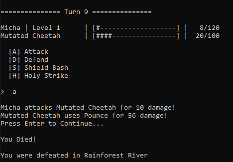
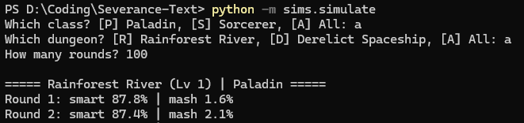
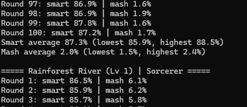
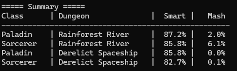

# Severance (Text Prototype)

A turn-based dungeon crawler in the terminal, written in Python. It's the text-based prototype of **Severance**, an FFXIV-style MMO I'm designing. Each version builds toward the full game:

Blackjack → **Text prototype (this repo)** → 2.5D version → 3D single-player → 3D multiplayer



## The world

Dungeons have been appearing across the world for two thousand years, growing bigger and more dangerous. Three pillars (Science, Magic and Religion) can't agree on why, but have to fight together to survive them.

## How to run

Needs **Python 3.12+**. There are no extra packages to install.

```
python main.py
```

## Features so far

- **Turn-based combat:** attack, defend, or use abilities with cooldowns
- **2 classes:**
  - **Paladin (Religion):** a tank with 7 abilities unlocked from level 1 to 20, including an AOE attack, a heal, a block and lifesteal
  - **Sorcerer (Magic):** a glass cannon with 7 elemental spells that cost mana, plus Mana Tide to restore it
- **Levelling:** XP, level-ups, stat growth and new abilities, up to level 20
- **2 dungeons:**
  - **Rainforest River:** 4 rooms of mutated animals, ending with a boss
  - **Derelict Spaceship:** 4 rooms of rogue robots, ending with a boss
- **Bosses:**
  - **Telegraphed attacks:** the boss warns you a turn before a big hit, so you can defend
  - **Enrage:** the boss gets stronger at low health
- **Group fights:** fight several enemies at once, with damage variance and defence scaling
- **Mana system:** mana bar, ability costs shown in the menu, regen every turn
- **Automated tests:** 16 pytest tests covering damage, healing, levelling, mana, cooldowns and the sim bot
- **Balance simulations:** a bot plays thousands of runs to measure how hard each dungeon is for each class

## Screenshots

**First fight:** pick an ability, choose a target



**Rest between rooms:** win XP, then catch your breath before the next fight


**Level up:** stats grow and a new ability unlocks



**Boss enrage + warning:** the Cheetah gets stronger at low health and warns you before it pounces


**Death:** ignore the boss's warning and Pounce hits hard



## Running the tests

Needs pytest (`pip install pytest`). From the project folder:

```
python -m pytest -v
```

16 tests, all passing:

| Test file | What it checks |
|---|---|
| `tests/test_character.py` | Health never drops below 0, blocking takes no damage, damage stays in its random range, healing can't go over max HP |
| `tests/test_player.py` | Paladin and Sorcerer starting stats (including mana), level-up stat growth, Holy Ground and Chain Lightning unlocking at level 2 |
| `tests/test_ability.py` | Cooldowns count down, casting takes the mana cost, you can't cast without enough mana, Mana Tide restores mana but never goes over max |
| `tests/test_sims.py` | The sim bot defends when a boss is preparing a big attack, and uses AOE on a group |

## Balance simulations

`sims/simulate.py` plays the game automatically thousands of times to check how hard each dungeon is. It uses the real game code, so it always matches the current game.

- **Smart bot:** defends when a boss warns you, uses AOE on groups, picks its strongest ability, and heals or restores mana when low
- **Mash bot:** only ever presses Attack, as a baseline
- **Pick a class** (Paladin, Sorcerer or All) and **a dungeon** (Rainforest, Spaceship or All). The Spaceship starts the hero at Lv 2
- **Runs in rounds of 5,000**, then prints the average, lowest and highest win rate, plus a summary table

From the project folder:

```
python -m sims.simulate
```





**Latest results** (win rate):

| Class | Dungeon | Smart bot | Mash bot |
|---|---|---|---|
| Paladin | Rainforest River (Lv 1) | 87.2% | 2.0% |
| Sorcerer | Rainforest River (Lv 1) | 85.8% | 6.1% |
| Paladin | Derelict Spaceship (Lv 2) | 85.8% | 0.0% |
| Sorcerer | Derelict Spaceship (Lv 2) | 82.7% | 0.1% |



The goal is for a player who plays well to win most of the time, while just mashing Attack almost never works. The sims shaped real changes: the first Sorcerer only won 35% of Rainforest runs, so it got more HP and defence, and Chain Lightning's mana cost was cut from 20 to 12 after the Sorcerer kept running out of mana in the Spaceship. Every change is in the Balance Log.

## Design docs

[`docs/Severance Design Docs.xlsx`](docs/Severance%20Design%20Docs.xlsx) has all the planning and balance work:

| Tab | What's in it |
|---|---|
| Monsters | Every enemy's stats, plus how much damage their defence blocks |
| Classes | Class stats, abilities and stats at every level |
| Dungeon Plans | The plan for each dungeon next to what's built so far |
| Build Order | What's next and in what order |
| Base Moves / Boss Specials / Damage Table | How enemy attacks work and how hard they hit |
| Sim Results | Simulation tests for new ideas, like the Paladin's planned Faith bar |
| Balance Log | Every balance change, why it was made, and how it was found (playtests or simulations) |

## Project structure

| File | What it does |
|---|---|
| `main.py` | Game start, battle loop, dungeon runs |
| `character.py` | Base class for anything that fights (health, damage, healing) |
| `player.py` | Player: XP, levelling, unlocking abilities |
| `classes.py` | Playable classes (Paladin, Sorcerer) |
| `ability.py` | Abilities: damage, heal, block, lifesteal, mana restore |
| `enemy.py` | Enemy and Boss AI |
| `move.py` | Boss special moves |
| `enemies.py` | Every enemy's stats |
| `dungeons.py` | Dungeon layouts |
| `tests/` | pytest tests (16) |
| `sims/simulate.py` | Balance simulations |

## Coming next

The Paladin's Faith bar, tutorial tips, branching paths in the Spaceship, a multi-floor Cave dungeon, then loot, shops and saving. The full list is on the Build Order tab.

## Credits

Claude (Anthropic's AI assistant) helped with this README, the game balancing (balance simulations and stat tuning) and the Severance Design Docs spreadsheet. The Balance Log shows which changes came from simulations and which came from my own playtests.

